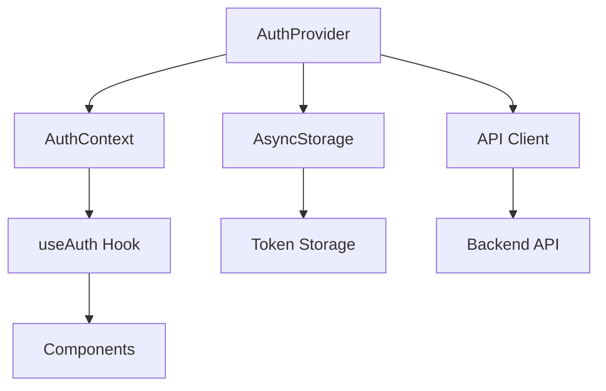
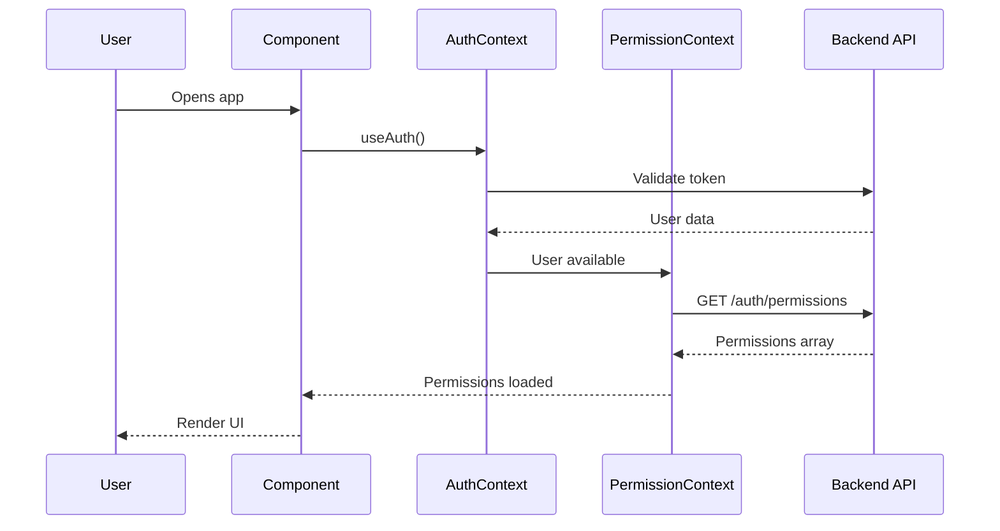

## Overview

The RIS Gran Chimú app uses React Context API for global state management. Two primary contexts handle authentication and permissions across the application.

---

## AuthContext

Manages user authentication state, login/logout operations, and session persistence.

### Location

`src/hooks/useAuth.tsx`

### Architecture



### Context Type

```tsx
type User = {
  id: string;
  name: string;
  role: string;
};

type AuthContextType = {
  user: User | null;
  signIn: (email: string, password: string) => Promise<void>;
  signOut: () => Promise<void>;
  loading: boolean;
};
```

### Provider Setup

```tsx app/_layout.tsx
import { AuthProvider } from '@/src/hooks/useAuth';

export default function RootLayout() {
  return (
    <AuthProvider>
      <Stack>
        <Stack.Screen name="landing" />
        <Stack.Screen name="(main)" />
      </Stack>
    </AuthProvider>
  );
}
```

### Implementation Details

<AccordionGroup>
  <Accordion title="State Management" icon="diagram-project">
    The AuthProvider maintains the following state:

    ```tsx
    const [user, setUser] = useState<User | null>(null);
    const [loading, setLoading] = useState(true);
    const expiryTimeoutRef = useRef<ReturnType<typeof setTimeout> | null>(null);
    ```

    - `user`: Current authenticated user or `null`
    - `loading`: `true` during initialization or login
    - `expiryTimeoutRef`: Timer for automatic logout on token expiry
  </Accordion>

  <Accordion title="Session Persistence" icon="floppy-disk">
    User sessions are stored in AsyncStorage:

    ```tsx
    const USER_STORAGE_KEY = '@ris_gran_chimu_user';

    // Save session
    await AsyncStorage.setItem(
      USER_STORAGE_KEY,
      JSON.stringify({ user: mappedUser, token })
    );

    // Load session
    const saved = await AsyncStorage.getItem(USER_STORAGE_KEY);
    if (saved) {
      const { user, token } = JSON.parse(saved);
      setUser(user);
      setAuthToken(token);
    }
    ```
  </Accordion>

  <Accordion title="Token Validation" icon="check-circle">
    On app startup, the provider validates the stored token:

    ```tsx
    const loadUser = async () => {
      const saved = await AsyncStorage.getItem(USER_STORAGE_KEY);
      if (!saved) return;

      const { user, token } = JSON.parse(saved);
      setAuthToken(token);

      try {
        // Validate with backend
        await apiClient.get('/auth/me');
        setUser(user);
        scheduleExpiry(token);
      } catch (err) {
        // Check local expiry if backend fails
        const payload = decodeJwt(token);
        const now = Math.floor(Date.now() / 1000);
        
        if (payload?.exp && payload.exp < now) {
          // Token expired
          signOut();
        } else {
          // Use local token
          setUser(user);
        }
      }
    };
    ```
  </Accordion>

  <Accordion title="Automatic Logout" icon="clock">
    The provider automatically logs out users when their JWT expires:

    ```tsx
    const decodeJwt = (token: string): { exp?: number } | null => {
      try {
        const payload = token.split('.')[1];
        const decoded = atob(payload.replace(/-/g, '+').replace(/_/g, '/'));
        return JSON.parse(decoded);
      } catch {
        return null;
      }
    };

    const scheduleExpiry = (token: string | null) => {
      if (!token) return;
      
      const payload = decodeJwt(token);
      if (!payload?.exp) return;

      const now = Math.floor(Date.now() / 1000);
      const delayMs = (payload.exp - now) * 1000;

      if (delayMs <= 0) {
        Alert.alert('Sesión expirada', 'Tu sesión ha caducado.', [
          { text: 'Aceptar', onPress: signOut },
        ]);
        return;
      }

      expiryTimeoutRef.current = setTimeout(() => {
        Alert.alert('Sesión expirada', 'Tu sesión ha caducado.', [
          { text: 'Aceptar', onPress: signOut },
        ]);
      }, delayMs);
    };
    ```
  </Accordion>
</AccordionGroup>

### Usage Examples

<CodeGroup>

```tsx Check Authentication
import { useAuth } from '@/src/hooks/useAuth';

export default function ProtectedScreen() {
  const { user, loading } = useAuth();

  if (loading) {
    return <ActivityIndicator />;
  }

  if (!user) {
    return <Redirect href="/landing" />;
  }

  return (
    <View>
      <Text>Welcome, {user.name}!</Text>
    </View>
  );
}
```

```tsx Login Form
import { useState } from 'react';
import { useAuth } from '@/src/hooks/useAuth';
import { TextInput, Button, Alert } from 'react-native';

export default function LoginScreen() {
  const [email, setEmail] = useState('');
  const [password, setPassword] = useState('');
  const { signIn, loading } = useAuth();

  const handleLogin = async () => {
    try {
      await signIn(email, password);
      // Redirects to dashboard automatically
    } catch (error) {
      // Error already handled by signIn
    }
  };

  return (
    <View>
      <TextInput
        value={email}
        onChangeText={setEmail}
        placeholder="Email"
        keyboardType="email-address"
      />
      <TextInput
        value={password}
        onChangeText={setPassword}
        placeholder="Password"
        secureTextEntry
      />
      <Button
        title={loading ? "Signing in..." : "Sign In"}
        onPress={handleLogin}
        disabled={loading}
      />
    </View>
  );
}
```

```tsx Logout Button
import { useAuth } from '@/src/hooks/useAuth';
import { Button, Alert } from 'react-native';

export default function ProfileScreen() {
  const { signOut } = useAuth();

  const handleLogout = () => {
    Alert.alert(
      'Confirm Logout',
      'Are you sure you want to log out?',
      [
        { text: 'Cancel', style: 'cancel' },
        { 
          text: 'Logout', 
          style: 'destructive',
          onPress: signOut 
        },
      ]
    );
  };

  return <Button title="Logout" onPress={handleLogout} />;
}
```

```tsx Role-Based Access
import { useAuth } from '@/src/hooks/useAuth';

export default function AdminPanel() {
  const { user } = useAuth();

  if (user?.role !== 'admin') {
    return (
      <View>
        <Text>You don't have permission to view this page.</Text>
      </View>
    );
  }

  return (
    <View>
      <Text>Admin Panel</Text>
      {/* Admin-only content */}
    </View>
  );
}
```

</CodeGroup>

---

## PermissionContext

Manages fine-grained permissions for authenticated users.

### Location

`src/context/PermissionContext.tsx`

### Context Type

```tsx
type PermissionContextType = {
  permissions: string[];
  loading: boolean;
  hasPermission: (code: string) => boolean;
  refreshPermissions: () => Promise<void>;
};
```

### Complete Implementation

```tsx src/context/PermissionContext.tsx
import React, { createContext, useContext, useEffect, useState } from 'react';
import apiClient from '../services/apiClient';
import { useAuth } from '../hooks/useAuth';

type PermissionContextType = {
  permissions: string[];
  loading: boolean;
  hasPermission: (code: string) => boolean;
  refreshPermissions: () => Promise<void>;
};

const PermissionContext = createContext<PermissionContextType | undefined>(undefined);

export function PermissionProvider({ children }: { children: React.ReactNode }) {
  const { user } = useAuth();
  const [permissions, setPermissions] = useState<string[]>([]);
  const [loading, setLoading] = useState(true);

  const loadPermissions = async () => {
    if (!user) {
      setPermissions([]);
      setLoading(false);
      return;
    }

    try {
      const res = await apiClient.get<string[]>('/auth/permissions');
      setPermissions(res.data);
    } catch (error) {
      console.error('Error loading permissions', error);
      setPermissions([]);
    } finally {
      setLoading(false);
    }
  };

  useEffect(() => {
    loadPermissions();
  }, [user]);

  const hasPermission = (code: string) => {
    // Admins have all permissions
    if (user?.role === 'admin') return true;
    return permissions.includes(code);
  };

  return (
    <PermissionContext.Provider 
      value={{ 
        permissions, 
        loading, 
        hasPermission, 
        refreshPermissions: loadPermissions 
      }}
    >
      {children}
    </PermissionContext.Provider>
  );
}

export function usePermissions() {
  const context = useContext(PermissionContext);
  if (!context) {
    throw new Error('usePermissions must be used within PermissionProvider');
  }
  return context;
}
```

### Provider Setup

```tsx app/_layout.tsx
import { AuthProvider } from '@/src/hooks/useAuth';
import { PermissionProvider } from '@/src/context/PermissionContext';

export default function RootLayout() {
  return (
    <AuthProvider>
      <PermissionProvider>
        <Stack>
          <Stack.Screen name="landing" />
          <Stack.Screen name="(main)" />
        </Stack>
      </PermissionProvider>
    </AuthProvider>
  );
}
```

<Warning>
  `PermissionProvider` must be nested inside `AuthProvider` because it depends on the `useAuth` hook.
</Warning>

### Permission Codes

Common permission codes used in the app:

| Permission Code | Description |
|----------------|-------------|
| `read:normas` | View normas |
| `write:normas` | Create/edit normas |
| `delete:normas` | Delete normas |
| `manage:users` | Manage user accounts |
| `view:analytics` | View analytics dashboard |
| `export:data` | Export data to files |

### Usage Examples

<CodeGroup>

```tsx Check Permission
import { usePermissions } from '@/src/context/PermissionContext';

export default function NormaDetailScreen() {
  const { hasPermission } = usePermissions();

  return (
    <View>
      <Text>Norma Details</Text>
      
      {hasPermission('write:normas') && (
        <Button title="Edit" onPress={handleEdit} />
      )}
      
      {hasPermission('delete:normas') && (
        <Button title="Delete" onPress={handleDelete} />
      )}
    </View>
  );
}
```

```tsx Conditional Rendering
import { usePermissions } from '@/src/context/PermissionContext';

export default function DashboardScreen() {
  const { hasPermission, loading } = usePermissions();

  if (loading) {
    return <ActivityIndicator />;
  }

  return (
    <ScrollView>
      <Text>Dashboard</Text>
      
      {hasPermission('view:analytics') && (
        <AnalyticsWidget />
      )}
      
      {hasPermission('manage:users') && (
        <UserManagementPanel />
      )}
    </ScrollView>
  );
}
```

```tsx Disable Actions
import { usePermissions } from '@/src/context/PermissionContext';

export default function ActionsMenu() {
  const { hasPermission } = usePermissions();

  return (
    <View>
      <Button
        title="Export Data"
        onPress={handleExport}
        disabled={!hasPermission('export:data')}
      />
      
      <Button
        title="Delete All"
        onPress={handleDeleteAll}
        disabled={!hasPermission('delete:normas')}
      />
    </View>
  );
}
```

```tsx Refresh Permissions
import { usePermissions } from '@/src/context/PermissionContext';

export default function SettingsScreen() {
  const { permissions, refreshPermissions, loading } = usePermissions();

  return (
    <View>
      <Text>Your Permissions:</Text>
      {permissions.map(perm => (
        <Text key={perm}>• {perm}</Text>
      ))}
      
      <Button
        title="Refresh Permissions"
        onPress={refreshPermissions}
        disabled={loading}
      />
    </View>
  );
}
```

</CodeGroup>

---

## Context Architecture

### Provider Hierarchy

```tsx
<AuthProvider>              // Authentication state
  <PermissionProvider>      // User permissions
    <App />                 // Your application
  </PermissionProvider>
</AuthProvider>
```

### Data Flow



---

## Best Practices

<CardGroup cols={2}>
  <Card title="Always Check Permissions" icon="shield-check">
    Use `hasPermission()` before rendering sensitive UI or performing protected actions
  </Card>

  <Card title="Handle Loading States" icon="spinner">
    Check `loading` from both contexts before rendering permission-based content
  </Card>

  <Card title="Backend Validation" icon="server">
    Always validate permissions on the backend. Frontend checks are for UX only
  </Card>

  <Card title="Refresh on Role Change" icon="arrows-rotate">
    Call `refreshPermissions()` after user role changes to update UI
  </Card>
</CardGroup>

<Note>
  Admin users automatically have all permissions via the `hasPermission` check, but specific permissions are still fetched from the backend.
</Note>

---

## Troubleshooting

<AccordionGroup>
  <Accordion title="useAuth must be used within AuthProvider" icon="triangle-exclamation">
    **Problem:** Component using `useAuth()` is not wrapped in `<AuthProvider>`

    **Solution:** Ensure your root layout includes the AuthProvider:
    ```tsx
    <AuthProvider>
      <YourApp />
    </AuthProvider>
    ```
  </Accordion>

  <Accordion title="usePermissions must be used within PermissionProvider" icon="triangle-exclamation">
    **Problem:** Component using `usePermissions()` is not wrapped in `<PermissionProvider>`

    **Solution:** Add PermissionProvider to your layout:
    ```tsx
    <AuthProvider>
      <PermissionProvider>
        <YourApp />
      </PermissionProvider>
    </AuthProvider>
    ```
  </Accordion>

  <Accordion title="Permissions not updating" icon="rotate-right">
    **Problem:** Permission changes not reflected in UI

    **Solution:** Call `refreshPermissions()` to reload permissions:
    ```tsx
    const { refreshPermissions } = usePermissions();
    await refreshPermissions();
    ```
  </Accordion>

  <Accordion title="Session not persisting" icon="floppy-disk">
    **Problem:** User logged out on app restart

    **Solution:** Check that AsyncStorage is properly configured and the token is being saved in `signIn()`
  </Accordion>
</AccordionGroup>